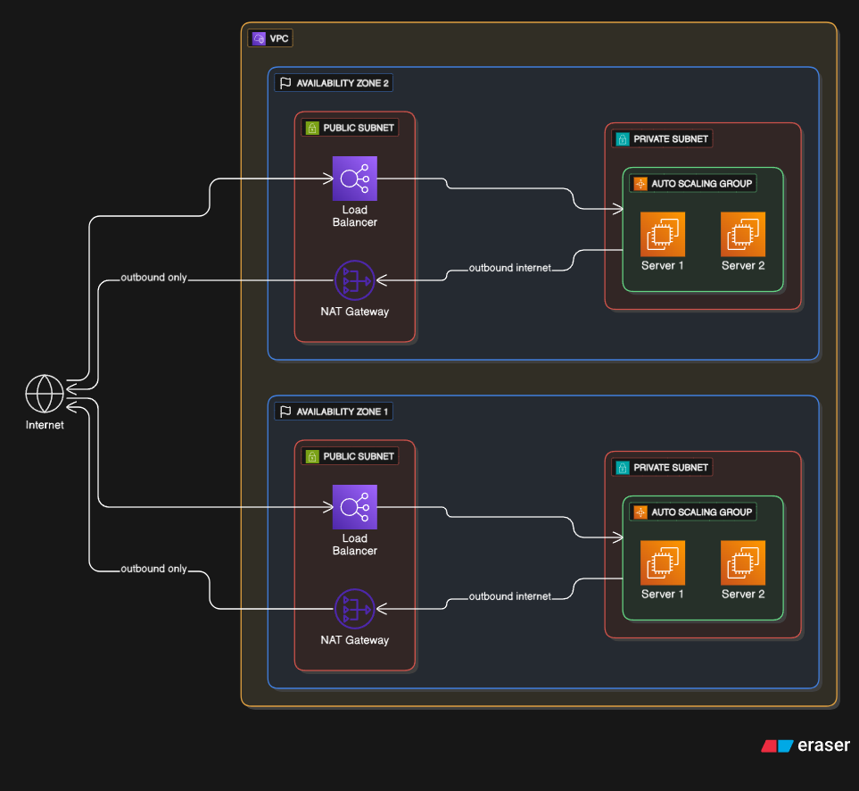

# AWS High Availability Architecture Project

## Project Overview
This project demonstrates a highly available AWS infrastructure setup using multiple AWS services. It is designed to handle web traffic efficiently and provide fault tolerance across multiple Availability Zones.

## Architecture Diagram

## Services Used
- **Amazon VPC**: Network isolation with public and private subnets.
- **Public Subnets & NAT Gateways**: For secure internet access from private instances.
- **Private Subnets**: Hosts backend servers inaccessible directly from the internet.
- **Application Load Balancer (ALB)**: Distributes incoming traffic across multiple servers.
- **Auto Scaling Group**: Automatically adjusts the number of backend servers based on traffic.
- **Security Groups**: Control inbound and outbound traffic to instances.

## Features
- High availability across two Availability Zones.
- Load balancing to distribute traffic efficiently.
- Auto Scaling to handle traffic spikes.
- Private subnets for secure backend resources.

## How to Recreate
1. Create a VPC with public and private subnets.
2. Configure NAT Gateways in public subnets.
3. Launch EC2 instances in private subnets and attach to an Auto Scaling Group.
4. Set up an Application Load Balancer to distribute traffic.
5. Configure Security Groups to control traffic.

